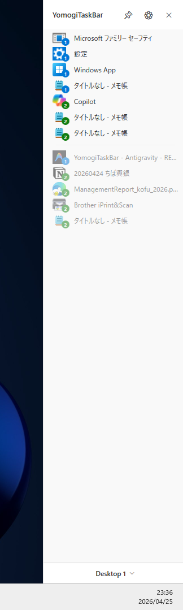

# YomogiTaskBar

YomogiTaskBarは、Windows用の垂直型タスクバーです。


## Features / 機能
- タスクバーの様に起動中アプリを一覧表示し、アプリの切り替えが可能
- マウス操作での対象アプリへの切り替え
- キー入力でのアプリの切り替え
　- `Win+Esc` で本アプリをフォーカス。上下キーでアプリを選択。`Enter` でアクティブ


## Requirements / 要件

- Windows 10 (Build 19041) or later
- .NET 9.0 Runtime / SDK


## Build and Run / ビルドと実行

1. Visual Studioでソリューションを開くか、コマンドラインを使用します。
2. リポジトリのルートから次を実行します。

```powershell
dotnet build
dotnet run --project YomogiTaskBar.csproj
```


## Project Structure / プロジェクト構成

- `YomogiTaskBar.csproj` - プロジェクトファイル / Project file
- `App.xaml` / `App.xaml.cs` - アプリ起動と多重起動防止 / App entry and single instance logic
- `MainWindow.xaml` / `MainWindow.xaml.cs` - メインタスクバーのUIと制御 / Main sidebar UI and logic
- `SettingsWindow.xaml` / `SettingsWindow.xaml.cs` - 設定画面 / Settings window
- `Controllers/` - AppBar制御とウィンドウ状態管理 / AppBar control and window state management
- `ViewModels/` - 表示用データモデル / ViewModels for UI binding
- `Managers/` - 各種機能管理（テーマ、設定、ホットキー等） / Functional managers (Theme, Settings, Hotkeys, etc.)
- `Models/` - 設定データ等のモデル定義 / Data models for settings and configurations
- `Themes/` - テーマリソース（Dark/Light） / Theme resources
- `Utilities/` - ネイティブAPI定義とロギング / Native API definitions and logging


## Notes / 注意事項

- 本アプリはAIによるプログラミングで作成しています。
- プログラム経験が浅いため、コードの品質には注意が必要です。


## License / ライセンス

This project is licensed under CC0-1.0.

このプロジェクトはCC0-1.0の下でライセンスされています。


## Screenshots / スクリーンショット


