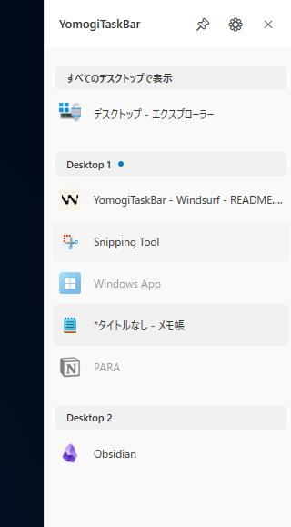
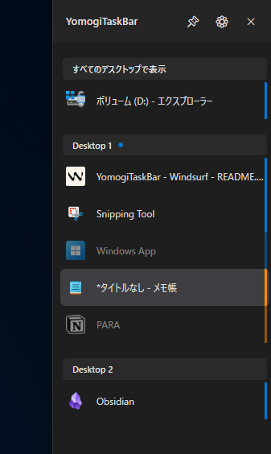

# YomogiTaskBar

YomogiTaskBarは、Windows用のミニマリストな垂直型タスクバーです。起動中のアプリケーションを仮想デスクトップごとに整理して一覧表示し、直感的な操作でアプリを切り替えることができます。

## Features / 主な機能

- **マルチデスクトップ管理**: 全仮想デスクトップのウィンドウを一画面にリストアップ。
- **直感的な操作**: 
  - マウスでの高速アクティブ化。
  - アイテムホバー時の「✕」ボタンで素早くウィンドウを閉じる。
- **キーボードナビゲーション**:
  - `Win + Esc` でタスクバーを呼び出し、上下キーで選択、`Enter` で決定。
  - **便利なショートカット**:
    - `Ctrl + J`: ウィンドウを最小化
    - `Ctrl + K`: ウィンドウを最大化/元に戻す
    - `Ctrl + L`: ウィンドウを閉じる
- **マルチモニター対応**: サブモニターのウィンドウをカラーバーで識別表示（左側固定）。
- **洗練されたUI**:
  - AppBar機能により画面端（左右）にドッキング。
  - ピン留め解除時は自動隠蔽（オートハイド）に対応。
  - システム設定に連動するライト/ダークテーマ。
- **スタートアップ対応**: Windows起動時に自動で常駐可能。

## Requirements / 要件

- Windows 10 (Build 19041) 以降
- .NET 9.0 Runtime / SDK

## Build and Run / ビルドと実行

1. Visual Studioでソリューションを開くか、コマンドラインを使用します。
2. リポジトリのルートから次を実行します。

```powershell
dotnet build
dotnet run --project YomogiTaskBar.csproj
```

## Project Structure / プロジェクト構成

- `MainWindow.xaml` / `.cs` - メインタスクバーのUIと制御（仮想デスクトップリスト表示）
- `SettingsWindow.xaml` / `.cs` - 各種ホットキーやスタートアップの設定
- `Controllers/` - AppBarの領域予約およびウィンドウ状態の制御
- `Managers/` - ウィンドウ列挙、UWPアイコン抽出、仮想デスクトップ連携、設定管理
- `Models/` - 設定データおよびショートカット設定の定義
- `ViewModels/` - ウィンドウ情報のバインド用データモデル
- `Utilities/` - Win32 APIのP/Invoke定義とロギング

## License / ライセンス

This project is licensed under CC0-1.0. (ただしアイコンは Tabler Icons (MIT) を使用しています)

---

## Screenshots / スクリーンショット


*仮想デスクトップごとに整理されたウィンドウリスト*


*システム設定に連動するモダンなダークモード*
